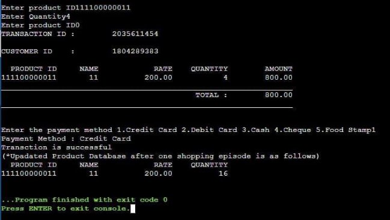
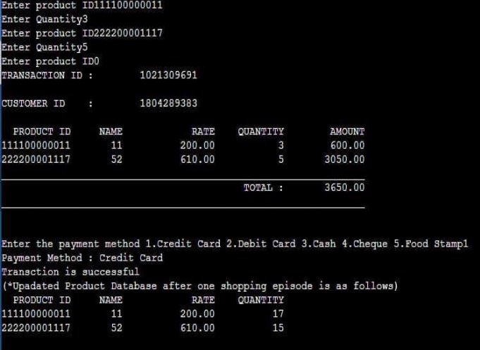
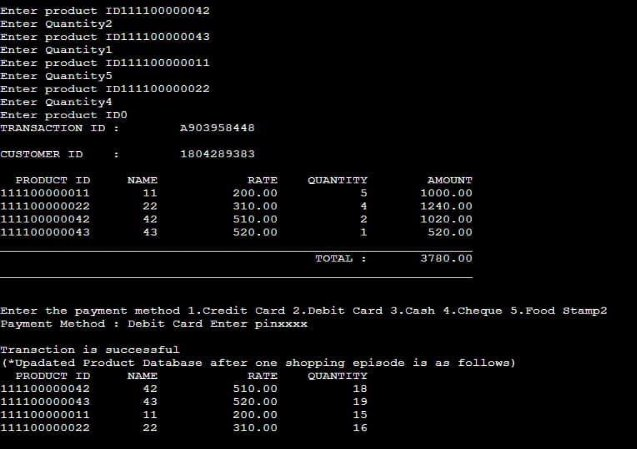

Readme file: 

**Super Market Software Product Line (SCSPL)** 

**Overview**: A supermarket software product line is a supermarket checkout system which contains both the Full-service checkout and Self-service checkout with the inventory system which controls the level of product stock in the supermarkets. We have developed code for only kernel path in this project including the inventory. 

This system includes the purchase of products, billing, and inventory system. We have created a rough product dataset in this project. We have included five methods of payment, cash, credit card, debit card, check and food stamp. Pin is required to make payment with debit card. 

**Requirements & installations:** 

This program does not require any specific requirements or installations. You can run the program on the cpp compiler. 

**Execution:** 

When you run the program, the compiler asks you to enter the product ID, quantity of the product. We keep on entering the product ID’s and when items are finished, 0 must be entered to get total bill. The compiler asks you for the payment method and you are allowed to choose the payment method of your choice. The compiler asks you for the pin if debit card is chosen as payment method. The updated product inventory information is also updated and displayed on the screen. 

**SCREENSHOTS:** 

**Figure 1: A single product is selected and credit card is chosen as a payment method** 

**Figure 2 : Two products are selected and credit card is chosen as payment method** 

**Figure 3 : Four products are selected and debit card is chosen as payment method. In this case, you need to enter the pin of        the card for the successful transaction** 

**Team Members :  Imran Gnananand Mounika Vandana** 
